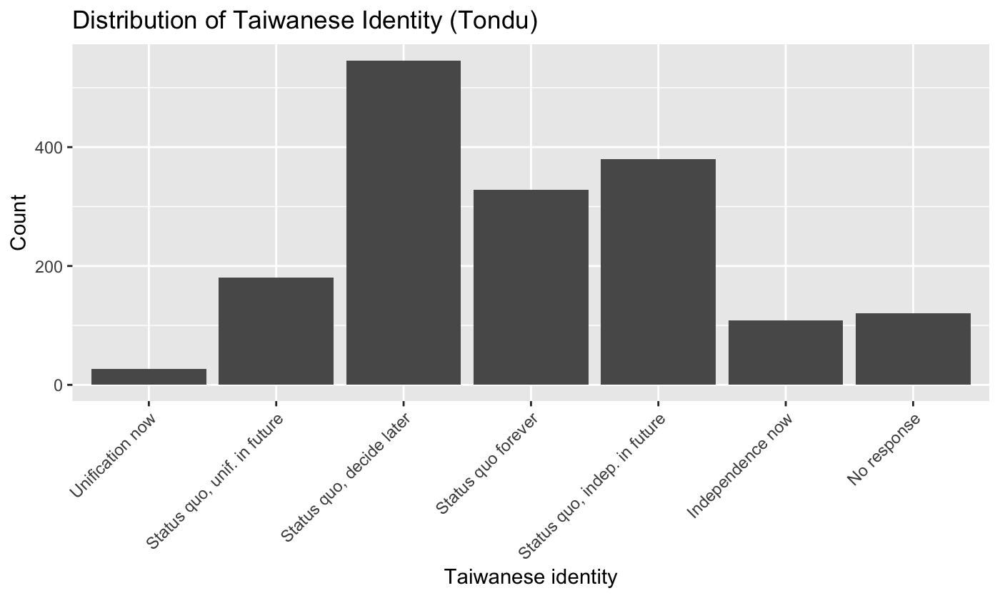
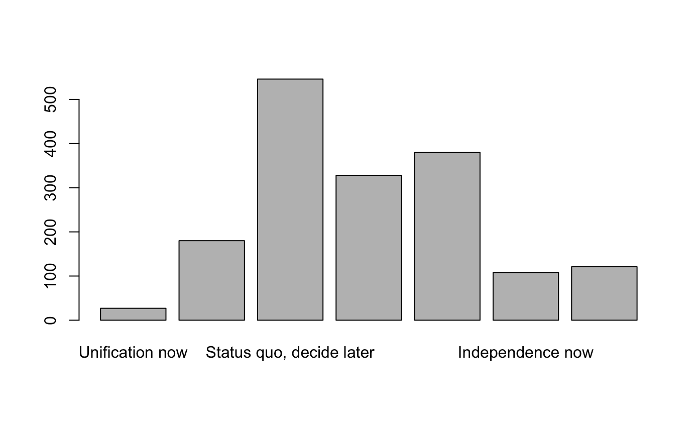
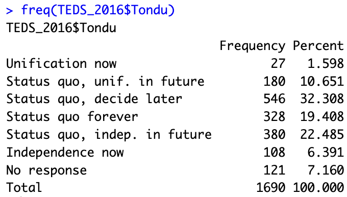

## Lab 01

\- [Lab01](../Lab01.html)

## Lab 02

\- [Lab02](..//Lab02.html)

## TEDS2016 Data Set

4.  What problems do you encounter when working with the dataset?
    -   There are missing value (NA)

    -   labelled variables as opposed to numeric

    -   Variables must be transformed to analyze
5.  Remove missing values using filter()

::: {.callout-note appearance="simple" icon="false"}
TEDS_clean \<- TEDS_2016 %\>%

filter(!is.na(income))
:::

6.  **Method**

    Step 1: Use filter() to remove missing values

    Step 2: Explore Tondu distribution using group_by() and summarize() to count observations

    Step 3: For categorical variables (gender, DPP support, education, and economic perceptions) we use frequency tables and for numerical values (age and income) we use box plots to compare distributions. Using ggplot(

7.  

    Step 1: remove missing values, filter()

    Step 2: Install ("descr") and use freq(TEDS_2016\$votetsai)

    Step 3: Create Bar chart using ggplot2

::: {.callout-note icon="false"}
install.packages ("descr")

library (descr)

teds_vote \<- TEDS_2016 %\>%

filter(!is.na(votetsai))

Freq(teds_vote\$votetsai)

Freq(teds_vote\$votetsai,

plot = FALSE)

ggplot(teds_vote, aes(x = votetsai)) +

geom_bar() +

labs(

title = "Vote for DPP Candidate Tsai Ing-wen",

x = "Vote for Tsai Ing-wen",

y = "Count"

)
:::

8.  

    ::: {.callout-note icon="false"}
    TEDS_2016\$Tondu\<-as.numeric(TEDS_2016\$Tondu,labels=c("Unification now”, “Status quo, unif. in future”, “Status quo, decide later", "Status quo forever", "Status quo, indep. in future", "Independence now”, “No response"))
    :::

{fig-align="center" width="502"}

{fig-align="center" width="500"}

{fig-align="center" width="350"}
